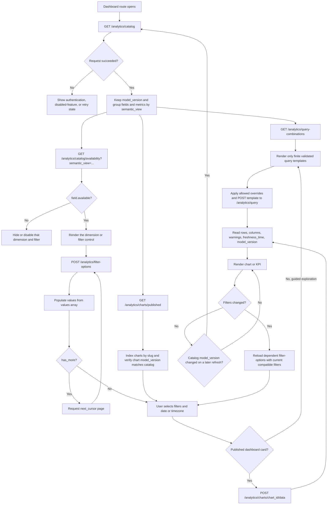
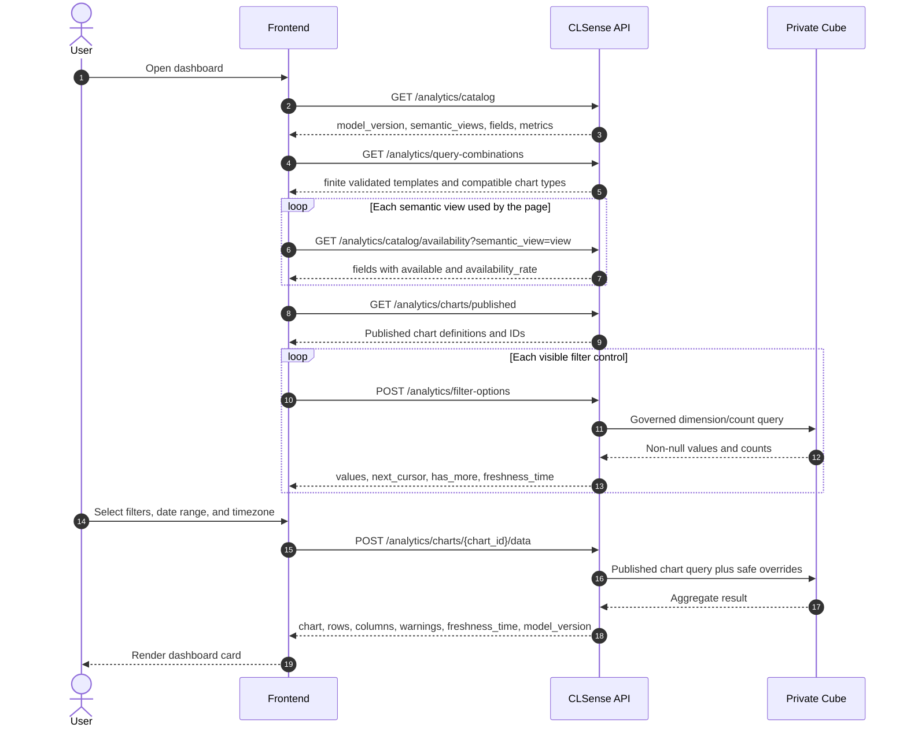

# Frontend workflow for dashboard analytics

This workflow shows how the frontend replaces legacy `GET /dashboard/*`
requests with the governed `/analytics` API. It begins by discovering which
dimensions are published and which of them actually contain data, then loads
filter values and published dashboard chart data.

All paths below are relative to the deployment API prefix (normally
`/wtchk/api`) and require `Authorization: Bearer <access-token>`.

## Request workflow



## Frontend request sequence



## What each discovery response means

| Call | Frontend use |
| --- | --- |
| `GET /analytics/catalog` | The allowlist of role-visible semantic views, dimensions, metrics, and chart types. Its `combinations` object supplies query limits, per-view member compatibility, grain meaning, and chart shapes. Only send slugs returned by this response. |
| `GET /analytics/query-combinations?semantic_view=...` | A finite collection of directly executable, active-catalog-validated query templates. Use this for guided exploration; preserve dimensions, metrics, time dimension, and grain, and change only the listed `allowed_overrides`. |
| `GET /analytics/catalog/availability?semantic_view=...` | Whether each catalog field has at least one non-null value in that view. Show fields where `available` is `true`; an availability rate below 1 still means the field can be used. |
| `GET /analytics/charts/published` | The governed dashboard cards visible to the caller. Store both `id` (for the data URL) and `slug` (stable frontend lookup). |
| `POST /analytics/filter-options` | Non-null dropdown values for one available dimension. Send already selected compatible filters to implement dependent selectors and follow `next_cursor` while `has_more` is true. |
| `POST /analytics/charts/{chart_id}/data` | Preferred path for a predefined dashboard card. The dimensions and metrics stay governed; the frontend may override filters, time range/granularity, timezone, order, and limit. |
| `POST /analytics/query` | For guided exploration, post a template returned by `GET /analytics/query-combinations`. Reserve free member selection from the catalog for an explicitly advanced ad-hoc explorer. |

Catalog membership and data availability are different: a field may be
published in the catalog but have `available: false` for the current BU. The
frontend must also keep assignment filters on their matching grain:
`topic` with `survey_topics`, `department` with `survey_departments`, and
`keyword` with `survey_keywords`. Response, store, and channel fields can also
appear in assignment views, but then every metric uses that assignment view's
row grain. Always take the final member list from the selected view's catalog
entry.

## Ad-hoc query selector flow

The recommended selector order is:

```text
What is being counted? -> How should it be grouped? -> What should be measured?
Semantic View          -> Dimensions                 -> Metrics
```

Do not make users guess from the raw semantic-view names. Present the row grain
as the business choice and store its corresponding `semantic_view` internally:

| User-facing choice | `semantic_view` | One counted row | Default metric |
| --- | --- | --- | --- |
| Survey responses | `survey_responses` | One response | `response_count` |
| Topic mentions | `survey_topics` | One topic assignment | `assignment_count` |
| Department assignments | `survey_departments` | One department assignment | `assignment_count` |
| Keyword mentions | `survey_keywords` | One keyword assignment | `assignment_count` |

Use the labels above for presentation only. At runtime, read `grain`,
`default_count_metric`, `assignment_dimension`, and the member lists from
`catalog.combinations.semantic_views`; do not duplicate those compatibility
lists in frontend code.

```mermaid
flowchart LR
    A[Load GET /analytics/catalog] --> B[User chooses analysis unit]
    B --> C[Resolve combinations.semantic_views entry]
    C --> D[Clear members and filters from the previous view]
    D --> E[Fetch availability for selected view]
    E --> F[Show available dimensions from the view entry]
    F --> G[User selects 0-3 dimensions]
    G --> H[Show metrics from the same view entry]
    H --> I[Preselect default_count_metric]
    I --> J[User selects 0-5 metrics]
    J --> K[Add compatible filters and optional time settings]
    K --> L{At least one dimension, metric, or time dimension?}
    L -- No --> G
    L -- Yes --> M[POST /analytics/query]
    M --> N{Response}
    N -- 200 --> O[Render from columns and rows]
    N -- 422 --> P[Show the governed validation error]
    N -- 503 --> Q[Show retry state without changing selections]
```



### 1. Build selector indexes from the catalog

The frontend needs both the per-view compatibility entry and the display
metadata from the top-level `fields` and `metrics` arrays:

```ts
type ExplorerState = {
  semanticView?: string;
  dimensions: string[];
  metrics: string[];
  filters: Array<{
    member: string;
    operator: string;
    value?: unknown;
    values?: unknown[];
  }>;
  timeDimension?: string;
  timeRange?: [string, string];
  timeGranularity?: string;
  timezone?: string;
  order: Array<{ member: string; direction: "asc" | "desc" }>;
  limit: number;
};

const viewRules = new Map(
  catalog.combinations.semantic_views.map(rule => [rule.semantic_view, rule]),
);

function groupByView<T extends { semantic_view: string }>(members: T[]) {
  const result = new Map<string, T[]>();
  for (const member of members) {
    result.set(member.semantic_view, [
      ...(result.get(member.semantic_view) ?? []),
      member,
    ]);
  }
  return result;
}

const fieldsByView = groupByView(catalog.fields);
const metricsByView = groupByView(catalog.metrics);
```

`combinations.semantic_views[].dimensions` and `.metrics` are the executable
allowlists. The top-level arrays provide `label`, `data_type`, `operation`, and
visibility metadata for rendering controls.

### 2. Handle a Semantic View change

A view change changes the row grain, even when a slug such as
`topic_sentiment`, `store_name`, or `distinct_survey_count` exists in both
views. Clear all dependent state instead of silently carrying those selections
into a new meaning:

```ts
async function selectSemanticView(semanticView: string) {
  const rule = viewRules.get(semanticView);
  if (!rule) throw new Error("Semantic View is not in the active catalog");

  state = {
    semanticView,
    dimensions: [],
    metrics: rule.default_count_metric ? [rule.default_count_metric] : [],
    filters: [],
    order: [],
    limit: 100,
  };

  availability = await api.getCatalogAvailability(semanticView);
  if (availability.model_version !== catalog.model_version) {
    catalog = await api.getCatalog();
    return selectSemanticView(semanticView);
  }
}
```

Reset `time_dimension`, `time_range`, and `time_granularity` as part of this
replacement state. Retaining a store or sentiment slug across views is unsafe
because the later metric counts a different kind of row.

### 3. Offer only valid Dimensions

Intersect the selected view's dimension allowlist with its fields and
availability result. Disable or hide fields that have no data for the current
BU:

```ts
function dimensionOptions() {
  const view = state.semanticView;
  if (!view) return [];

  const allowed = new Set(viewRules.get(view)?.dimensions ?? []);
  const available = new Map(
    availability.fields.map(field => [field.slug, field.available]),
  );

  return (fieldsByView.get(view) ?? []).filter(field =>
    allowed.has(field.slug) && available.get(field.slug) === true
  );
}
```

Use dimension labels that explain the two sentiment meanings:

| Dimension | Frontend label | Meaning |
| --- | --- | --- |
| `topic_sentiment` | Overall response sentiment | Sentiment of the complete survey response; valid in every view |
| `sentiment` | Topic/Department/Keyword sentiment | Sentiment of the current assignment row; assignment views only |

Useful defaults are the view's `assignment_dimension` (`topic`, `department`,
or `keyword`) for an assignment view, and `store_name` or `topic_sentiment` for
common response exploration. Defaults still need to be present in the current
view's dimension allowlist and availability response.

### 4. Offer only valid Metrics

Metrics are filtered by the selected view, not by the selected dimension. Any
published metric listed in that view is query-compatible with its dimensions:

```ts
function metricOptions() {
  const view = state.semanticView;
  if (!view) return [];

  const allowed = new Set(viewRules.get(view)?.metrics ?? []);
  return (metricsByView.get(view) ?? []).filter(metric =>
    allowed.has(metric.slug)
  );
}
```

Explain count metrics by their unit so users do not accidentally change the
question:

| Metric | Selector description |
| --- | --- |
| `response_count` | Number of matching survey responses |
| `responding_store_count` | Number of distinct stores having at least one matching response |
| `assignment_count` | Number of matching topic, department, or keyword assignments |
| `distinct_survey_count` | Number of surveys having at least one matching assignment |

For example, `survey_topics + topic + assignment_count` answers "how many topic
assignments?", while replacing the metric with `distinct_survey_count` answers
"how many surveys mentioned this topic?".

### 5. Validate and build the request

Use the limits returned in `catalog.combinations.query`, not hard-coded values.
The final client-side check should reject stale or cross-view members before
sending the payload:

```ts
function buildQuery() {
  const view = state.semanticView;
  const rule = view && viewRules.get(view);
  if (!view || !rule) throw new Error("Choose what to analyse");

  const dimensions = state.dimensions.filter(slug =>
    rule.dimensions.includes(slug)
  );
  const metrics = state.metrics.filter(slug => rule.metrics.includes(slug));
  const filterMembersAreValid = state.filters.every(filter =>
    rule.dimensions.includes(filter.member)
  );

  if (dimensions.length !== state.dimensions.length ||
      metrics.length !== state.metrics.length ||
      !filterMembersAreValid) {
    throw new Error("A selection no longer belongs to the selected view");
  }
  if (dimensions.length > catalog.combinations.query.max_dimensions ||
      metrics.length > catalog.combinations.query.max_metrics ||
      state.filters.length > catalog.combinations.query.max_filters) {
    throw new Error("The query exceeds catalog limits");
  }
  if (!dimensions.length && !metrics.length && !state.timeDimension) {
    throw new Error("Select a dimension, metric, or time dimension");
  }
  if (state.timeDimension) {
    const timeField = (fieldsByView.get(view) ?? []).find(
      field => field.slug === state.timeDimension,
    );
    if (!rule.dimensions.includes(state.timeDimension) ||
        !timeField ||
        !["date", "time"].includes(timeField.data_type)) {
      throw new Error("Choose a date/time dimension from the selected view");
    }
    if (dimensions.includes(state.timeDimension)) {
      throw new Error("Do not repeat the time dimension as a dimension");
    }
  } else if (state.timeRange || state.timeGranularity) {
    throw new Error("Time range and granularity require a time dimension");
  }

  const selected = new Set([
    ...dimensions,
    ...metrics,
    ...(state.timeDimension ? [state.timeDimension] : []),
  ]);
  if (state.order.some(item => !selected.has(item.member))) {
    throw new Error("Order members must also be selected");
  }

  return {
    semantic_view: view,
    dimensions,
    metrics,
    filters: state.filters,
    ...(state.timeDimension && { time_dimension: state.timeDimension }),
    ...(state.timeRange && { time_range: state.timeRange }),
    ...(state.timeGranularity && {
      time_granularity: state.timeGranularity,
    }),
    ...(state.timezone && { timezone: state.timezone }),
    order: state.order,
    limit: state.limit,
  };
}
```

`order[].member` must be one of the selected dimensions, metrics, or time
dimension. A `time_dimension` must be a date/time field from the same view;
`time_range` and `time_granularity` are invalid without it.

### 6. Example: Topic sentiment for each store

The user choices translate as follows:

```text
Analyse:  Survey responses          -> survey_responses
Group by: Store and overall sentiment -> store_key, store_name, topic_sentiment
Measure:  Number of responses       -> response_count
```

```json
{
  "semantic_view": "survey_responses",
  "dimensions": ["store_key", "store_name", "topic_sentiment"],
  "metrics": ["response_count"],
  "order": [{"member": "response_count", "direction": "desc"}],
  "limit": 1000
}
```

If the intended question is instead "what is each store's average sentiment
score?", keep the response view, remove `topic_sentiment`, and select
`topic_sentiment_score_average` plus `response_count`. Do not switch to a topic
assignment view, because responses with more topics would then carry more
weight.

### Guided mode versus advanced mode

Use `GET /analytics/query-combinations` for the default guided experience. The
user selects a named business question; its Semantic View, Dimensions, Metrics,
and compatible chart types are already fixed and validated. Apply only the
returned `allowed_overrides`.

Expose the selector state machine above only as an advanced explorer. This
keeps the common path finite and understandable while still allowing every
combination published by the active catalog.

## Legacy dashboard replacement map

| Legacy request | New published chart slug | Semantic view |
| --- | --- | --- |
| `GET /dashboard/sentiment-distribution` | `dashboard_sentiment_distribution` | `survey_responses` |
| `GET /dashboard/store-distribution` | `dashboard_store_distribution` | `survey_responses` |
| `GET /dashboard/store-column-sentiment-distribution` | `dashboard_store_format_distribution` | `survey_responses` |
| `GET /dashboard/channel-and-delivery-service-distribution` | `dashboard_channel_delivery_distribution` | `survey_responses` |
| `GET /dashboard/topic-sentiment-score` | `dashboard_topic_sentiment_counts`, `dashboard_overall_topic_sentiment_score`, `dashboard_mixed_topic_sentiment_score` | `survey_responses` |
| `GET /dashboard/topic-distribution` | `dashboard_topic_distribution` | `survey_topics` |
| `GET /dashboard/department-distribution` | `dashboard_department_distribution` | `survey_departments` |
| `GET /dashboard/keyword-analysis` | `dashboard_keyword_analysis` | `survey_keywords` |
| `GET /dashboard/data-coverage` | `dashboard_first_reported_at`, `dashboard_last_reported_at` | `survey_responses` |
| `GET /dashboard/last-updated-date` | `dashboard_last_updated_at` | `survey_responses` |

One legacy response can therefore require more than one published chart-data
request. Resolve the chart IDs from `GET /analytics/charts/published`; do not
hard-code database IDs.

## Minimal request bodies

Load a filter dropdown after `store_format` was found in the catalog and marked
available:

```json
{
  "semantic_view": "survey_responses",
  "member": "store_format",
  "filters": [
    {"member": "topic_sentiment", "operator": "equals", "value": "NEGATIVE"}
  ],
  "timezone": "Asia/Hong_Kong",
  "limit": 100,
  "cursor": 0
}
```

Run the resolved `dashboard_store_format_distribution` chart with the chosen
value:

```json
{
  "filters": [
    {"member": "store_format", "operator": "equals", "value": "Mall"}
  ],
  "time_range": ["2026-08-01", "2026-08-31"],
  "timezone": "Asia/Hong_Kong"
}
```

Treat `401` as an authentication failure, `404` as analytics disabled or the
chart not visible, `422` as an invalid member/filter combination, and `503` as
a retryable analytics dependency failure. Analytics responses are private and
`no-store`; keep them in application state rather than a shared HTTP cache.

## Pytest coverage

The hermetic API test
`test_frontend_dashboard_analytics_discovery_and_chart_flow` executes the
catalog, availability, published-chart, filter-option, and chart-data chain.
The deployment-level suite in `backend/tests/test_analytics_dashboard_e2e.py`
adds authentication, every built-in dashboard chart, filter combinations,
timezone boundaries, assignment-grain rejection, and optional legacy-result
comparison.

```bash
.venv/bin/python -m pytest -q backend/tests/test_analytics_api.py \
  -k frontend_dashboard_analytics_discovery_and_chart_flow
```

For the live command and required environment variables, see
[Analytics dashboard test request](ANALYTICS_DASHBOARD_TEST_REQUEST.md#reusable-pytest-runner).
