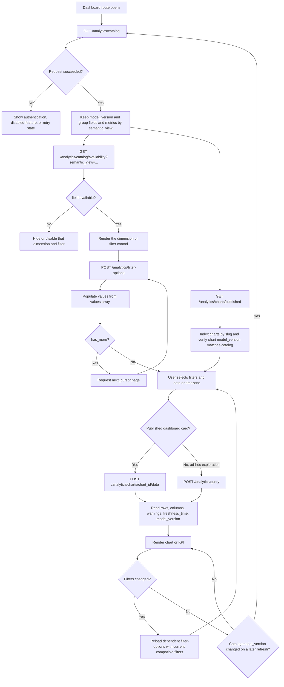
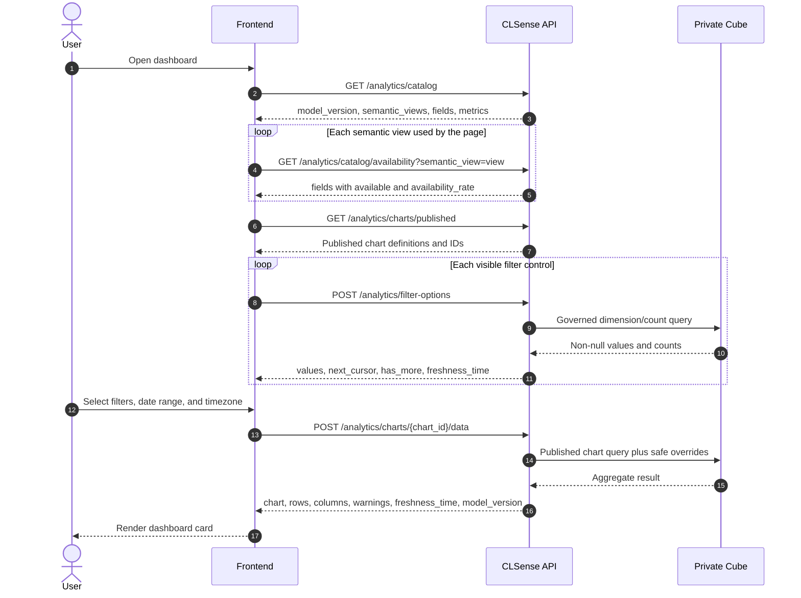

# Frontend workflow for dashboard analytics

This workflow shows how the frontend replaces legacy `GET /dashboard/*`
requests with the governed `/analytics` API. It begins by discovering which
dimensions are published and which of them actually contain data, then loads
filter values and published dashboard chart data.

All paths below are relative to the deployment API prefix (normally
`/wtchk/api`) and require `Authorization: Bearer <access-token>`.

## Request workflow



## Frontend request sequence



## What each discovery response means

| Call | Frontend use |
| --- | --- |
| `GET /analytics/catalog` | The allowlist of role-visible semantic views, dimensions, metrics, and chart types. Only send slugs returned by this response. |
| `GET /analytics/catalog/availability?semantic_view=...` | Whether each catalog field has at least one non-null value in that view. Show fields where `available` is `true`; an availability rate below 1 still means the field can be used. |
| `GET /analytics/charts/published` | The governed dashboard cards visible to the caller. Store both `id` (for the data URL) and `slug` (stable frontend lookup). |
| `POST /analytics/filter-options` | Non-null dropdown values for one available dimension. Send already selected compatible filters to implement dependent selectors and follow `next_cursor` while `has_more` is true. |
| `POST /analytics/charts/{chart_id}/data` | Preferred path for a predefined dashboard card. The dimensions and metrics stay governed; the frontend may override filters, time range/granularity, timezone, order, and limit. |
| `POST /analytics/query` | Use only for an ad-hoc explorer whose dimensions and metrics were selected from the catalog. |

Catalog membership and data availability are different: a field may be
published in the catalog but have `available: false` for the current BU. The
frontend must also keep assignment filters on their matching grain:
`topic` with `survey_topics`, `department` with `survey_departments`, and
`keyword` with `survey_keywords`. Common response/store/channel fields belong
to `survey_responses`.

## Legacy dashboard replacement map

| Legacy request | New published chart slug | Semantic view |
| --- | --- | --- |
| `GET /dashboard/sentiment-distribution` | `dashboard_sentiment_distribution` | `survey_responses` |
| `GET /dashboard/store-distribution` | `dashboard_store_distribution` | `survey_responses` |
| `GET /dashboard/store-column-sentiment-distribution` | `dashboard_store_format_distribution` | `survey_responses` |
| `GET /dashboard/channel-and-delivery-service-distribution` | `dashboard_channel_delivery_distribution` | `survey_responses` |
| `GET /dashboard/topic-sentiment-score` | `dashboard_topic_sentiment_counts`, `dashboard_overall_topic_sentiment_score`, `dashboard_mixed_topic_sentiment_score` | `survey_responses` |
| `GET /dashboard/topic-distribution` | `dashboard_topic_distribution` | `survey_topics` |
| `GET /dashboard/department-distribution` | `dashboard_department_distribution` | `survey_departments` |
| `GET /dashboard/keyword-analysis` | `dashboard_keyword_analysis` | `survey_keywords` |
| `GET /dashboard/data-coverage` | `dashboard_first_reported_at`, `dashboard_last_reported_at` | `survey_responses` |
| `GET /dashboard/last-updated-date` | `dashboard_last_updated_at` | `survey_responses` |

One legacy response can therefore require more than one published chart-data
request. Resolve the chart IDs from `GET /analytics/charts/published`; do not
hard-code database IDs.

## Minimal request bodies

Load a filter dropdown after `store_format` was found in the catalog and marked
available:

```json
{
  "semantic_view": "survey_responses",
  "member": "store_format",
  "filters": [
    {"member": "topic_sentiment", "operator": "equals", "value": "NEGATIVE"}
  ],
  "timezone": "Asia/Hong_Kong",
  "limit": 100,
  "cursor": 0
}
```

Run the resolved `dashboard_store_format_distribution` chart with the chosen
value:

```json
{
  "filters": [
    {"member": "store_format", "operator": "equals", "value": "Mall"}
  ],
  "time_range": ["2026-08-01", "2026-08-31"],
  "timezone": "Asia/Hong_Kong"
}
```

Treat `401` as an authentication failure, `404` as analytics disabled or the
chart not visible, `422` as an invalid member/filter combination, and `503` as
a retryable analytics dependency failure. Analytics responses are private and
`no-store`; keep them in application state rather than a shared HTTP cache.

## Pytest coverage

The hermetic API test
`test_frontend_dashboard_analytics_discovery_and_chart_flow` executes the
catalog, availability, published-chart, filter-option, and chart-data chain.
The deployment-level suite in `backend/tests/test_analytics_dashboard_e2e.py`
adds authentication, every built-in dashboard chart, filter combinations,
timezone boundaries, assignment-grain rejection, and optional legacy-result
comparison.

```bash
.venv/bin/python -m pytest -q backend/tests/test_analytics_api.py \
  -k frontend_dashboard_analytics_discovery_and_chart_flow
```

For the live command and required environment variables, see
[Analytics dashboard test request](ANALYTICS_DASHBOARD_TEST_REQUEST.md#reusable-pytest-runner).
