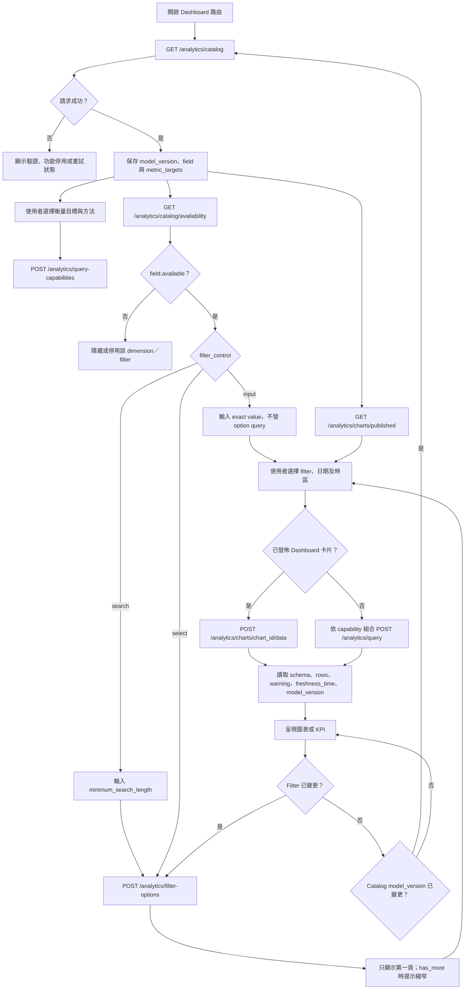

# 前端儀表板 Analytics 工作流程

> 文件狀態：現行 Frontend 整合指南
>
> 導覽：[Backend 文件索引](README.md)
>
> 最後核對：2026-09-07

> Query builder 請使用[目標優先的 Analytics 查詢契約](ANALYTICS_GOAL_FIRST_CONTRACT.md)定義的邏輯 target 探索順序。

此工作流程說明前端如何使用受治理的 `/analytics` API；舊有 `GET /dashboard/*` 已移除並回傳
`404`。流程先探索已發佈、且在目前 BU 確實有資料的 dimension，再載入 filter value 與已發佈
dashboard chart data。

以下所有路徑皆相對於部署 API prefix（一般為 `/wtchk/api`），且需要 `Authorization: Bearer <access-token>`。

## 請求流程



## 初始化與探索端點

| 呼叫 | 前端用途 |
| --- | --- |
| `GET /analytics/catalog` | 角色可見的 semantic view、dimension、邏輯 `metric_targets`。`combinations` 提供 query limit 與 grain 含義。只可傳送這個回應中的 target／method pair。 |
| `POST /analytics/query-capabilities` | 驗證已選 target／method，回傳允許的 dimension、filter member／operator、time dimension 與 result type。用它建立其餘 selector。 |
| `GET /analytics/query-combinations?semantic_view=...` | 已經 active-catalog 驗證、可直接執行的有限 query template 集合。引導式探索保留其 dimension、metric／aggregation、time dimension 及 grain，只修改 `allowed_overrides` 中列出的欄位。 |
| `GET /analytics/catalog/availability?semantic_view=...` | 各 catalog field 在 view 中是否至少有一個非 null 值。只顯示 `available: true` 的 field；availability rate 小於 1 並不代表不可使用。 |
| `GET /analytics/charts/published` | 呼叫端可見的受治理 Dashboard card。保存 `id`（data URL 使用）、`slug`（穩定前端查找）及 `{x,y,w,h}` overview layout；舊 snapshot 由 Backend 補上確定性 fallback。 |
| `POST /analytics/filter-options` | 只為 catalog 的 `select`／`search` field 取回 non-null option。`select` 只顯示第一頁；`search` 必須先輸入 `minimum_search_length`。`input` field 不可呼叫此 endpoint，直接輸入 exact value。 |
| `POST /analytics/charts/{chart_id}/data` | 預先定義 Dashboard card 的優先路徑。dimension 與單一 metric／aggregation 維持受治理；前端只能覆寫 filter、time range／granularity、timezone、order 及 limit。 |
| `POST /admin/analytics/dashboard-layout/publish` | Admin 傳送完整 12 欄 draft 及 `expected_model_version`；成功後新 immutable snapshot 原子生效，相同重試不建立新版本。 |
| `POST /analytics/query` | 傳送目標優先 query 的 metric、aggregation、dimension、filter 與可選 time control。不必傳 `semantic_view`；回應會列出伺服器解析出的 grain。 |

Catalog membership 與 data availability 不相同：field 可以在 catalog 發佈，卻對目前 BU 回傳 `available: false`。Assignment filter 必須留在相符 grain：`topic` 對 `survey_topics`、`department` 對 `survey_departments`、`keyword` 對 `survey_keywords`。response、store 與 channel field 也可出現在 assignment view，但其 metric 會依該 assignment view 的 row grain 計算。

## 建議的介面模式

預設使用 **引導模式**：從 `GET /analytics/query-combinations` 顯示已命名的業務問題，使用者只調整 `allowed_overrides`。這是最容易理解的常見操作路徑。

將下列 **進階探索模式** 留給需要自由組合的人員：

```text
衡量什麼 → 依什麼拆分 → 再依什麼拆分（或按時間） → 如何彙總 → 繪製何種圖表
```

前端不應將 raw `semantic_view` 呈現為必填 query choice。它是可在 view-scoped discovery endpoint 內部使用的路由狀態，伺服器才是選擇最終 grain 的權威。

舊式 view-scoped selector 的語意如下：

| 使用者看到的選擇 | `semantic_view` | 一筆 fact row 的意義 | 預設 target + aggregation |
| --- | --- | --- | --- |
| 問卷回應 | `survey_responses` | 一個 response | `survey` + `count` |
| 主題提及 | `survey_topics` | 一個 topic assignment | `topic_assignment` + `count` |
| 部門 assignment | `survey_departments` | 一個 department assignment | `department_assignment` + `count` |
| 關鍵字提及 | `survey_keywords` | 一個 keyword assignment | `keyword_assignment` + `count` |

執行時應從 `catalog.combinations.semantic_views` 讀取 `grain`、`assignment_dimension` 與 dimension list，再從 `catalog.metric_targets[semantic_view]` 讀取可執行 pair；chart type 則由前端按 response shape 決定。

## 狀態與請求建立

每次分析單位、目標或方法變更時，清除相依狀態：

- View 變更時清除 dimension、filter、time dimension、time range、time granularity、排序與前一個 capability；即使 `topic_sentiment`、`store_name` 或 `survey_id` 同時存在於兩個 view，它們的 row grain 仍可能不同。
- Target／method 變更後，先呼叫 `/analytics/query-capabilities`，再以其 `allowed_dimensions` 與 availability 回應取交集。
- 若 availability 的 `model_version` 與 catalog 不同，重新載入 catalog 並重新建立 selector。
- 選擇帶有封閉 enum 值的 dimension 時，可同時提供逐值 metric target（例如 `topic_sentiment_mixed/count`）和依該 dimension 分組的做法；前者不佔用 group-by slot。

建立 query 前，前端應驗證：

1. `dimensions` 最多三個，全部屬於目前 catalog／capability 的允許清單。
2. `metric` 與 `aggregation` 恰各一個，且是 resolved view 中的 active `metric_targets` pair。
3. `filters` 最多 20 個，每個 member 與 operator 均由 capability 宣告。
4. `time_dimension` 必須是允許的 date/time field，且不得重複出現在 `dimensions`；`time_range` 與 `time_granularity` 需要 time dimension。
5. `order[].member` 只能是已選 dimension、所選 time dimension 或固定 key `value`。
6. `limit` 與其他限制採用 `catalog.combinations.query` 回傳值，不要硬編碼。

一個可傳送的範例：

```json
{
  "dimensions": ["store_format", "topic_sentiment"],
  "metric": "survey",
  "aggregation": "count",
  "filters": [{"member": "region", "operator": "equals", "value": "North"}],
  "time_dimension": "reported_at",
  "time_granularity": "day",
  "timezone": "Asia/Hong_Kong",
  "order": [{"member": "reported_at", "direction": "asc"}],
  "limit": 100
}
```

伺服器會拒絕 stale／cross-view member、未發佈或 ambiguous pair、超過三個 dimension、無 time dimension 的 time control，以及已移除的 renderer 欄位，通常回傳 `422`。當 Cube 或 Analytics 資料庫無法服務時回傳 `503`；應顯示可重試狀態，而非變更使用者選擇。

## 感情色彩與指標語意

前端必須清楚區分兩種 sentiment：

| Dimension | 建議前端標籤 | 含義 |
| --- | --- | --- |
| `topic_sentiment` | 整體回應情緒 | 完整問卷 response 的 sentiment；所有 view 都有效。 |
| `sentiment` | 主題／部門／關鍵字情緒 | 目前 assignment row 的 sentiment；只適用於 assignment view。 |

Target 同樣需要以單位說明，避免使用者不小心變更問題：

| Target + aggregation | 說明 |
| --- | --- |
| `survey` + `count`，在 `survey_responses` | 相符問卷回應數 |
| `store` + `count` | 至少有一筆相符 response 的相異門市數 |
| `<entity>_assignment` + `count` | 相符的 topic、department 或 keyword assignment 數 |
| `survey` + `count`，在 assignment view | 至少有一筆相符 assignment 的相異問卷數 |
| `cls` + `average` | response-grain 的平均 CLS；不可在 cross-assignment query 中使用。 |

例如，在 `survey_topics` 中以 `topic` 分組並使用 `topic_assignment/count` 回答「有多少個 topic assignment？」；改用 `survey/count` 則回答「有多少份問卷提到此 topic？」。

## Comparison 的單一 Entity Breakdown

Comparison 除了「相同 entity／不同期間」與「不同 entity／相同期間」，也支援固定一個
entity，再按另一個 assignment dimension 比較。為避免把同一份問卷的 assignment 重複次數
錯當成 sentiment 權重，Frontend 只公開以下四個組合：

| 固定 entity | Breakdown | Semantic view | 預設 measure |
| --- | --- | --- | --- |
| Store | Department | `survey_departments` | `department_sentiment` + `average` |
| Store | Topic | `survey_topics` | `topic_assignment_sentiment` + `average` |
| Department | Store | `survey_departments` | `department_sentiment` + `average` |
| Topic | Store | `survey_topics` | `topic_assignment_sentiment` + `average` |

Department ↔ Topic 不公開。選擇其他 measure 時，Frontend 必須將
`POST /analytics/builder/options {}` 的 `available_measures`、measure 的
`semantic_views`，以及 catalog 對 resolved view 發佈的 target／aggregation 取交集。

例如 Store A 按 Department 比較：

```json
{
  "measure": {"field": "department_sentiment"},
  "aggregation": "average",
  "breakdown": "department",
  "filters": [
    {
      "member": "store_name_english",
      "operator": "equals",
      "value": "Store A"
    }
  ],
  "time_range": ["2026-08-01", "2026-08-31"],
  "timezone": "Asia/Hong_Kong",
  "order": [{"member": "value", "direction": "desc"}],
  "limit": 1000
}
```

這個模式使用一個 shared date range，沒有 time series。額外 filters 不得重複固定 entity、
breakdown member 或 `reported_at`，並最多 18 個，保留兩個位置給固定 entity 與執行時的
target-value `in` filter。

完整 breakdown 名單從 `POST /analytics/records/query` 的 `full` representation 讀取
`stores`、`departments` 或 `topics`，每頁 1,000 筆並跟隨 `has_more`。空白名稱會略過，
相同顯示值會去重。為避免 aggregate 的 1,000-row limit 把未回傳項目誤判為沒有資料，
Frontend 會按最多 1,000 個 master values 分段，以最多兩個並行 builder query 執行，再驗證
所有回應的 semantic view、schema、metric 與 `model_version` 相同後合併。

有數值的 rows 依 metric 由高至低排列並交給 chart；缺少 aggregate row 的 master value 只在
完整表格中顯示 `No data`，不會轉成 `0`。若全部沒有資料，仍顯示完整 master-data 表格及
chart empty state。Assignment sentiment 的數值定義維持 `POSITIVE=1`、`NEGATIVE=0`、
`NEUTRAL=-1`，所以平均值範圍是 `-1` 至 `1`。

## 圖表選擇與呈現

以 frontend 的 response-shape matrix 選擇 renderer：

| Query shape | 相容 chart type |
| --- | --- |
| 無時間、0 個 dimension | `kpi`、`table` |
| 無時間、1 個 dimension | `bar`、`column`、`line`、`area`、`pie`、`donut`、`polar_area`、`radar`、`table` |
| 無時間、2 個 dimension | `stacked_bar`、`grouped_bar`、`heatmap`、`table` |
| 無時間、3 個 dimension | `table` |
| 有粒度時間、0–1 個一般 dimension | `line`、`area`、`table` |
| 有粒度時間、2–3 個一般 dimension | `table` |

這個矩陣屬於 frontend renderer；不要把 `chart_type` 傳到 `/analytics/query` 來要求後端判斷相容性。`line` 與 `area` 在有 time dimension 時需要 `time_granularity`，也可用於無時間的一般分類資料。除 `table` 與 `kpi` 外，metric result 必須是 number。`scatter` 與 `store_map` 不受支援。

共用 aggregate response 使用 `schema` 與 flat `rows`；不要依 metric property name 查值：

- `line`／`area`：若有 `schema.time_dimension`，它是 X axis；零個一般 dimension 表示單一 series，一個一般 dimension 為 series key。若無時間，第一個一般 dimension 為 category axis。
- `pie`／`donut`／`polar_area`／`radar`：第一個一般 dimension 是 category，`value` 是各 category 的數值。
- `stacked_bar`：第一個 dimension 是 category，第二個是 series。
- `heatmap`：兩個 dimension key 標識 cell，`value` 是 intensity。
- `kpi`：讀取唯一 row 的 `value`。
- `table`：依序顯示 `schema.dimensions`、可選 `schema.time_dimension`、`schema.metric`；metric cell 一律讀取 `value`。

Query response 不含 renderer layout 或 series cap。前端依 `schema.dimensions`、`schema.time_dimension`、`schema.metric` 與完整 long-format `rows` 自行決定 axis、series、top-N 與缺格處理；不要把 `chart_type`、`series_limit` 或 `fill_empty` 傳至 query endpoints。兩個非時間 group 會帶 `group_role: primary` 與 `secondary`；共用 renderer 在 returned `row_count` 小於或等於 build-time `NEXT_PUBLIC_ANALYTICS_DUAL_GROUP_GRAPH_MAX_ROWS`（預設 `20`）時，以 `primary-secondary` 合併 label 餵給既有二維 chart，超過時保留原始兩欄轉為 table。這是 frontend display policy，不會改寫 query。

## 兩個操作範例

### 各門市的整體回應情緒

使用者選擇：

```text
分析：問卷回應
依此分組：門市與整體情緒
衡量：回應數
```

請求：

```json
{
  "dimensions": ["store_key", "store_name", "topic_sentiment"],
  "metric": "survey",
  "aggregation": "count",
  "order": [{"member": "value", "direction": "desc"}],
  "limit": 1000
}
```

若問題改為「每間門市的平均情緒分數」，保留 response grain，移除 `topic_sentiment`，並選 `topic_sentiment_score` + `average`。若 UI 也需要樣本數，另以 `survey/count` 發出第二個 query。不可切換至 topic assignment view，否則含較多 topic 的 response 會帶有較大權重。

### 自由圖表：MIXED keyword × department

以 Builder API 逐步選取：

```text
measure: topic_sentiment = MIXED
aggregation: count
breakdown: keyword
series: department
```

呼叫 `POST /analytics/builder/options` 後，應解析為 `survey_assignments` grain。完成選擇後，以 `POST /analytics/builder/query` 執行。該 grain 的 count 會按 response key 去重，因此同一 response 在每一個 keyword／department cell 至多計算一次。

### 自由圖表：每間門市的每週 CLS

選取 `cls` + `average`、breakdown 為門市、series 時間為 `reported_at/week`。Builder 會解析為 `survey_responses`。若再加入 keyword、department 或 topic 的第二個 assignment family，組合會失效：該交叉要求 `survey_assignments`，而 `cls/average` 在該 grain 不安全。

## 錯誤、快取與測試

- `401` 表示缺少、無效、已刪除或錯誤設定檔的 token；`403` 表示角色不足；`404` 表示 Analytics 停用或資源不可見；`422` 表示受治理的輸入或語意 query 無效；`503` 表示 Cube 或資料庫目前無法使用。
- 所有 Analytics 回應均為 `Cache-Control: no-store, private`。以前端記憶體保存同一個 catalog 的暫存即可；切換帳號、profile 或 model version 時必須丟棄。
- 每張 API 回應應保存並顯示 `freshness_time` 與 `model_version`。Chart 的 model version 與 catalog 不一致時，重新載入 catalog 和 chart list。
- 以 [Analytics 儀表板驗證請求](ANALYTICS_DASHBOARD_TEST_REQUEST.md#可重複使用的-pytest-執行器)中的 live pytest suite 驗證登入、filter discovery、static bearer 存取、non-UTC time range、assignment-grain isolation、chart contract 與 freshness metadata。
