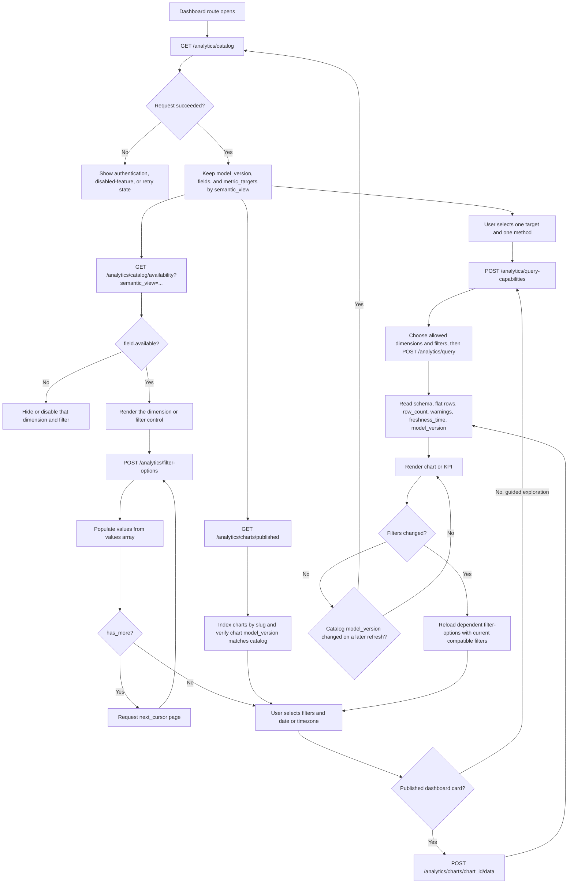
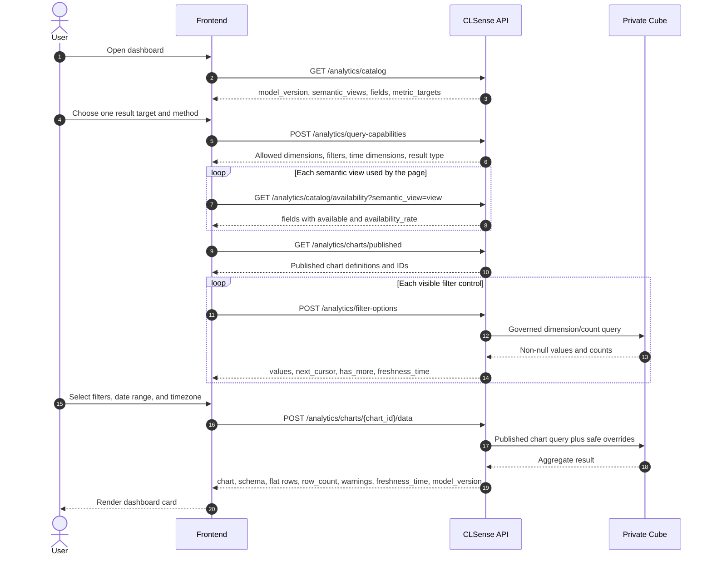
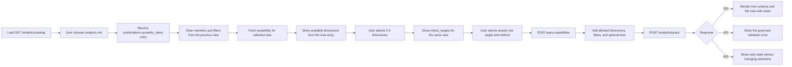

# Frontend workflow for dashboard analytics

> Query builders use the logical-target discovery sequence defined in
> [Goal-first analytics query contract](ANALYTICS_GOAL_FIRST_CONTRACT.md).

This workflow shows how the frontend replaces legacy `GET /dashboard/*`
requests with the governed `/analytics` API. It begins by discovering which
dimensions are published and which of them actually contain data, then loads
filter values and published dashboard chart data.

All paths below are relative to the deployment API prefix (normally
`/wtchk/api`) and require `Authorization: Bearer <access-token>`.

## Request workflow



## Frontend request sequence



## What each discovery response means

| Call | Frontend use |
| --- | --- |
| `GET /analytics/catalog` | The allowlist of role-visible semantic views, dimensions, logical `metric_targets`, and chart types. Its `combinations` object supplies query limits, grain meaning, and chart shapes. Only send target/method pairs returned by this response. |
| `POST /analytics/query-capabilities` | Validates the selected target/method and returns allowed dimensions, filter members/operators, time dimensions, and result type. Use this response to build the remaining controls. |
| `GET /analytics/query-combinations?semantic_view=...` | A finite collection of directly executable, active-catalog-validated query templates. Use this for guided exploration; preserve dimensions, the one metric/aggregation pair, time dimension, and grain, and change only the listed `allowed_overrides`. |
| `GET /analytics/catalog/availability?semantic_view=...` | Whether each catalog field has at least one non-null value in that view. Show fields where `available` is `true`; an availability rate below 1 still means the field can be used. |
| `GET /analytics/charts/published` | The governed dashboard cards visible to the caller. Store both `id` (for the data URL) and `slug` (stable frontend lookup). |
| `POST /analytics/filter-options` | Non-null dropdown values for one available dimension. Send already selected compatible filters to implement dependent selectors and follow `next_cursor` while `has_more` is true. |
| `POST /analytics/charts/{chart_id}/data` | Preferred path for a predefined dashboard card. Dimensions and the one metric/aggregation pair stay governed; the frontend may override filters, time range/granularity, timezone, order, and limit. |
| `POST /analytics/query` | For guided exploration, post the goal-first query assembled from the catalog and capability response. Curated templates remain available from `GET /analytics/query-combinations`. |

Catalog membership and data availability are different: a field may be
published in the catalog but have `available: false` for the current BU. The
frontend must also keep assignment filters on their matching grain:
`topic` with `survey_topics`, `department` with `survey_departments`, and
`keyword` with `survey_keywords`. Response, store, and channel fields can also
appear in assignment views, but then every metric uses that assignment view's
row grain. Always take the final member list from the selected view's catalog
entry.

## Ad-hoc query selector flow

The recommended selector order is:

```text
What does one row mean? -> What should be measured? -> How?        -> Group/filter by?
Semantic View           -> Logical target           -> Aggregation -> Capabilities
```

Do not make users guess from the raw semantic-view names. Present the row grain
as the business choice and store its corresponding `semantic_view` internally:

| User-facing choice | `semantic_view` | One fact row | Default target + aggregation |
| --- | --- | --- | --- |
| Survey responses | `survey_responses` | One response | `survey` + `count` |
| Topic mentions | `survey_topics` | One topic assignment | `topic_assignment` + `count` |
| Department assignments | `survey_departments` | One department assignment | `department_assignment` + `count` |
| Keyword mentions | `survey_keywords` | One keyword assignment | `keyword_assignment` + `count` |

Use the labels above for presentation only. At runtime, read `grain`,
`assignment_dimension`, and the dimension list from
`catalog.combinations.semantic_views`, then read executable pairs from
`catalog.metric_targets[semantic_view]`; do not duplicate those compatibility
lists in frontend code.



### 1. Build selector indexes from the catalog

The frontend needs both per-view field metadata and the logical targets from
the top-level `metric_targets` value:

```ts
type ExplorerState = {
  semanticView?: string;
  dimensions: string[];
  metric?: string;
  aggregation?: "count" | "distinct_count" | "sum" | "average" | "min" | "max" | "median";
  filters: Array<{
    member: string;
    operator: string;
    value?: unknown;
    values?: unknown[];
  }>;
  timeDimension?: string;
  timeRange?: [string, string];
  timeGranularity?: string;
  timezone?: string;
  order: Array<{ member: string; direction: "asc" | "desc" }>;
  limit: number;
};

const viewRules = new Map(
  catalog.combinations.semantic_views.map(rule => [rule.semantic_view, rule]),
);

function groupByView<T extends { semantic_view: string }>(members: T[]) {
  const result = new Map<string, T[]>();
  for (const member of members) {
    result.set(member.semantic_view, [
      ...(result.get(member.semantic_view) ?? []),
      member,
    ]);
  }
  return result;
}

const fieldsByView = groupByView(catalog.fields);
const metricTargetsByView = new Map(
  Object.entries(catalog.metric_targets),
);
```

`metric_targets[view]` is the executable result-goal allowlist. Each entry has
`metric`, `label`, `entity`, and a nested `aggregations` array. A theoretically
meaningful operation absent from this list must not be sent.

### 2. Handle a Semantic View change

A view change changes the row grain, even when a slug such as
`topic_sentiment`, `store_name`, or `survey_id` exists in both
views. Clear all dependent state instead of silently carrying those selections
into a new meaning:

```ts
async function selectSemanticView(semanticView: string) {
  const rule = viewRules.get(semanticView);
  if (!rule) throw new Error("Semantic View is not in the active catalog");

  state = {
    semanticView,
    dimensions: [],
    metric: semanticView === "survey_responses"
      ? "survey"
      : `${semanticView.replace("survey_", "").replace(/s$/, "")}_assignment`,
    aggregation: "count",
    filters: [],
    order: [],
    limit: 100,
  };

  availability = await api.getCatalogAvailability(semanticView);
  if (availability.model_version !== catalog.model_version) {
    catalog = await api.getCatalog();
    return selectSemanticView(semanticView);
  }
}
```

Reset `time_dimension`, `time_range`, and `time_granularity` as part of this
replacement state. Retaining a store or sentiment slug across views is unsafe
because the later metric counts a different kind of row.

### 3. Offer only valid Dimensions

After choosing the target and method, call `/analytics/query-capabilities` and
intersect its `allowed_dimensions` with the availability result. Disable or
hide fields that have no data for the current BU:

```ts
function dimensionOptions() {
  const view = state.semanticView;
  if (!view) return [];

  const allowed = new Set(capabilities.allowed_dimensions.map(field => field.slug));
  const available = new Map(
    availability.fields.map(field => [field.slug, field.available]),
  );

  return (fieldsByView.get(view) ?? []).filter(field =>
    allowed.has(field.slug) && available.get(field.slug) === true
  );
}
```

Use dimension labels that explain the two sentiment meanings:

| Dimension | Frontend label | Meaning |
| --- | --- | --- |
| `topic_sentiment` | Overall response sentiment | Sentiment of the complete survey response; valid in every view |
| `sentiment` | Topic/Department/Keyword sentiment | Sentiment of the current assignment row; assignment views only |

Useful defaults are the view's `assignment_dimension` (`topic`, `department`,
or `keyword`) for an assignment view, and `store_name` or `topic_sentiment` for
common response exploration. Defaults still need to be present in the current
view's dimension allowlist and availability response.

### 4. Offer only valid targets and methods

The query takes one logical target and one method. Show only targets published
for the selected view, then only the chosen target's nested methods:

```ts
function metricTargets() {
  const view = state.semanticView;
  if (!view) return [];
  return metricTargetsByView.get(view) ?? [];
}
```

Explain targets by their unit so users do not accidentally change the
question:

| Target + aggregation | Selector description |
| --- | --- |
| `survey` + `count` in `survey_responses` | Number of matching survey responses |
| `store` + `count` | Number of represented stores having at least one matching response |
| `<entity>_assignment` + `count` | Number of matching topic, department, or keyword assignments |
| `survey` + `count` in an assignment view | Number of unique surveys having at least one matching assignment |

For example, `survey_topics + topic + topic_assignment/count` answers "how many
topic assignments?", while selecting `survey/count` answers "how many surveys
mentioned this topic?".

### 5. Validate and build the request

Use the limits returned in `catalog.combinations.query`, not hard-coded values.
The final client-side check should reject stale or cross-view members before
sending the payload:

```ts
function buildQuery() {
  const view = state.semanticView;
  const rule = view && viewRules.get(view);
  if (!view || !rule) throw new Error("Choose what to analyse");

  const dimensions = state.dimensions.filter(slug =>
    rule.dimensions.includes(slug)
  );
  const optionIsValid = (metricTargetsByView.get(view) ?? []).some(target =>
    target.metric === state.metric && target.aggregations.some(
      option => option.method === state.aggregation
    )
  );
  const filterMembersAreValid = state.filters.every(filter =>
    capabilities.filter_members.some(member => member.field === filter.member)
  );

  if (dimensions.length !== state.dimensions.length ||
      !optionIsValid ||
      !filterMembersAreValid) {
    throw new Error("A selection no longer belongs to the selected view");
  }
  if (dimensions.length > catalog.combinations.query.max_dimensions ||
      state.filters.length > catalog.combinations.query.max_filters) {
    throw new Error("The query exceeds catalog limits");
  }
  if (state.timeDimension) {
    const timeField = (fieldsByView.get(view) ?? []).find(
      field => field.slug === state.timeDimension,
    );
    if (!capabilities.allowed_time_dimensions.some(
          field => field.slug === state.timeDimension
        ) || !timeField) {
      throw new Error("Choose a date/time dimension from the selected view");
    }
    if (dimensions.includes(state.timeDimension)) {
      throw new Error("Do not repeat the time dimension as a dimension");
    }
  } else if (state.timeRange || state.timeGranularity) {
    throw new Error("Time range and granularity require a time dimension");
  }

  const selected = new Set([
    ...dimensions,
    "value",
    ...(state.timeDimension ? [state.timeDimension] : []),
  ]);
  if (state.order.some(item => !selected.has(item.member))) {
    throw new Error("Order members must also be selected");
  }

  return {
    semantic_view: view,
    dimensions,
    metric: state.metric,
    aggregation: state.aggregation,
    filters: state.filters,
    ...(state.timeDimension && { time_dimension: state.timeDimension }),
    ...(state.timeRange && { time_range: state.timeRange }),
    ...(state.timeGranularity && {
      time_granularity: state.timeGranularity,
    }),
    ...(state.timezone && { timezone: state.timezone }),
    order: state.order,
    limit: state.limit,
  };
}
```

`order[].member` must be one of the selected dimensions, the fixed key `value`,
or the selected time dimension. A `time_dimension` must be a date/time field from the same view;
`time_range` and `time_granularity` are invalid without it.

### 6. Choose a chart from the query shape

Use `catalog.combinations.charts` as the runtime source of truth. The current
strict matrix is:

| Query shape | Compatible chart types |
| --- | --- |
| No time, 0 dimensions | `kpi`, `table` |
| No time, 1 dimension | `bar`, `column`, `pie`, `donut`, `table` |
| No time, 2 dimensions | `stacked_bar`, `heatmap`, `table` |
| No time, 3 dimensions | `table` |
| Granular time, 0–1 ordinary dimension | `line`, `area`, `table` |
| Granular time, 2–3 ordinary dimensions | `table` |

`line` and `area` require `time_dimension` and `time_granularity`; do not offer
them for a raw or absent time field. Except for `table` and `kpi`, require
`schema.metric.type === "number"`. `scatter` and `store_map` are not supported.

Render the common response without metric-specific property lookup:

- `line` / `area`: `schema.time_dimension.key` is the X axis; zero ordinary
  dimensions gives one series and one ordinary dimension provides the series
  key.
- `stacked_bar`: first dimension is the category and second is the series.
- `heatmap`: the two dimension keys identify the cell; `value` is intensity.
- `kpi`: read the sole row's `value`.
- `table`: show `schema.dimensions`, optional `schema.time_dimension`, then
  `schema.metric`, reading the metric cell from `value`.

### 7. Example: Topic sentiment for each store

The user choices translate as follows:

```text
Analyse:  Survey responses          -> survey_responses
Group by: Store and overall sentiment -> store_key, store_name, topic_sentiment
Measure:  Number of responses       -> id + count
```

```json
{
  "semantic_view": "survey_responses",
  "dimensions": ["store_key", "store_name", "topic_sentiment"],
  "metric": "survey",
  "aggregation": "count",
  "order": [{"member": "value", "direction": "desc"}],
  "limit": 1000
}
```

If the intended question is instead "what is each store's average sentiment
score?", keep the response view, remove `topic_sentiment`, and select
`topic_sentiment_score` + `average`. A second query using `id` + `count` is
required if the UI also needs the sample size. Do not switch to a topic
assignment view, because responses with more topics would then carry more
weight.

### Guided mode versus advanced mode

Use `GET /analytics/query-combinations` for the default guided experience. The
user selects a named business question; its Semantic View, Dimensions, one
Metric/Aggregation pair, and compatible chart types are already fixed and validated. Apply only the
returned `allowed_overrides`.

Expose the selector state machine above only as an advanced explorer. This
keeps the common path finite and understandable while still allowing every
combination published by the active catalog.

## Chart builder flow

The builder endpoints are the recommended path for a free-form chart designer.
They invert the selector above: the user starts from what they want to see and
the server resolves the row grain, so `semantic_view` is never a user-facing
choice.

```text
1. what to measure   GET  /analytics/builder/measures
2. break down by     POST /analytics/builder/options
3. and by / over     POST /analytics/builder/options
4. aggregate         POST /analytics/builder/options
5. draw as           POST /analytics/builder/options -> compatible_chart_types
6. run               POST /analytics/builder/query
```

Re-post the whole partial selection to `builder/options` after every change and
render only what comes back. The steps are order-independent, so a user may pick
the breakdowns before the aggregation. Two consequences are worth handling in
the UI:

- `available_series_dimensions` shrinks once a measure is chosen. A response
  average such as CLS cannot be crossed with a second assignment family, so
  those options disappear and `warnings` says why.
- `compatible_chart_types` changes as dimensions are added or removed. Keep the
  chart picker disabled until it is non-empty, rather than letting the user
  choose a type the data shape cannot support.

### Worked example: MIXED sentiment by keyword and department

```text
Measure:   Topic sentiment is MIXED   -> topic_sentiment:MIXED + count
Break by:  Keyword                    -> rows
And by:    Department                 -> columns
Draw as:   Grouped bar                -> also valid: heatmap, table
```

```json
{
  "measure": {"field": "topic_sentiment", "enum_value": "MIXED"},
  "aggregation": "count",
  "breakdown": "keyword",
  "series": {"dimension": "department"},
  "chart_type": "grouped_bar",
  "fill_empty": true,
  "limit": 200
}
```

The server routes this to `survey_assignments` and counts distinct responses per
cell. `schema.layout` returns `row_dimension: "keyword"` and
`column_dimension: "department"`, so pivot on those two keys and read `value`.
Because `keyword` is unbounded, the column axis is capped at ten series by
default; raise it with `series_limit` and check `layout.truncated_series` before
claiming the chart is complete. `fill_empty` adds the zero cells that make the
grid rectangular.

### Worked example: weekly CLS per store

```text
Measure:   CLS                        -> cls + average
Break by:  Store                      -> one line each
Over:      1 week buckets             -> reported_at + week
Draw as:   Line                       -> also valid: area, table
```

```json
{
  "measure": {"field": "cls"},
  "aggregation": "average",
  "breakdown": "store_name_english",
  "series": {"time": {"field": "reported_at", "interval": "week"}},
  "chart_type": "line",
  "timezone": "Asia/Hong_Kong"
}
```

This stays on `survey_responses`, the cheapest grain that answers it. The layout
puts `reported_at` on rows and `store_name_english` on columns, so each store
becomes one line. With hundreds of stores the default cap keeps the top ten by
total; show `layout.truncated_series` and let the user filter to specific stores
rather than raising the cap indefinitely.

## Legacy dashboard replacement map

| Legacy request | New published chart slug | Semantic view |
| --- | --- | --- |
| `GET /dashboard/sentiment-distribution` | `dashboard_sentiment_distribution` | `survey_responses` |
| `GET /dashboard/store-distribution` | `dashboard_store_distribution` | `survey_responses` |
| `GET /dashboard/store-column-sentiment-distribution` | `dashboard_store_format_distribution` | `survey_responses` |
| `GET /dashboard/channel-and-delivery-service-distribution` | `dashboard_channel_delivery_distribution` | `survey_responses` |
| `GET /dashboard/topic-sentiment-score` | `dashboard_topic_sentiment_counts`, `dashboard_overall_topic_sentiment_score`, `dashboard_mixed_topic_sentiment_score` | `survey_responses` |
| `GET /dashboard/topic-distribution` | `dashboard_topic_distribution` | `survey_topics` |
| `GET /dashboard/department-distribution` | `dashboard_department_distribution` | `survey_departments` |
| `GET /dashboard/keyword-analysis` | `dashboard_keyword_analysis` | `survey_keywords` |
| `GET /dashboard/data-coverage` | `dashboard_first_reported_at`, `dashboard_last_reported_at` | `survey_responses` |
| `GET /dashboard/last-updated-date` | `dashboard_last_updated_at` | `survey_responses` |

One legacy response can therefore require more than one published chart-data
request. Resolve the chart IDs from `GET /analytics/charts/published`; do not
hard-code database IDs.

## Minimal request bodies

Load a filter dropdown after `store_format` was found in the catalog and marked
available:

```json
{
  "semantic_view": "survey_responses",
  "member": "store_format",
  "filters": [
    {"member": "topic_sentiment", "operator": "equals", "value": "NEGATIVE"}
  ],
  "timezone": "Asia/Hong_Kong",
  "limit": 100,
  "cursor": 0
}
```

Run the resolved `dashboard_store_format_distribution` chart with the chosen
value:

```json
{
  "filters": [
    {"member": "store_format", "operator": "equals", "value": "Mall"}
  ],
  "time_range": ["2026-08-01", "2026-08-31"],
  "timezone": "Asia/Hong_Kong"
}
```

Treat `401` as an authentication failure, `404` as analytics disabled or the
chart not visible, `422` as an invalid member/filter combination, and `503` as
a retryable analytics dependency failure. Analytics responses are private and
`no-store`; keep them in application state rather than a shared HTTP cache.

## Pytest coverage

The hermetic API test
`test_frontend_dashboard_analytics_discovery_and_chart_flow` executes the
catalog, availability, published-chart, filter-option, and chart-data chain.
The deployment-level suite in `backend/tests/test_analytics_dashboard_e2e.py`
adds authentication, every built-in dashboard chart, filter combinations,
timezone boundaries, assignment-grain rejection, and optional legacy-result
comparison.

```bash
.venv/bin/python -m pytest -q backend/tests/test_analytics_api.py \
  -k frontend_dashboard_analytics_discovery_and_chart_flow
```

For the live command and required environment variables, see
[Analytics dashboard test request](ANALYTICS_DASHBOARD_TEST_REQUEST.md#reusable-pytest-runner).
